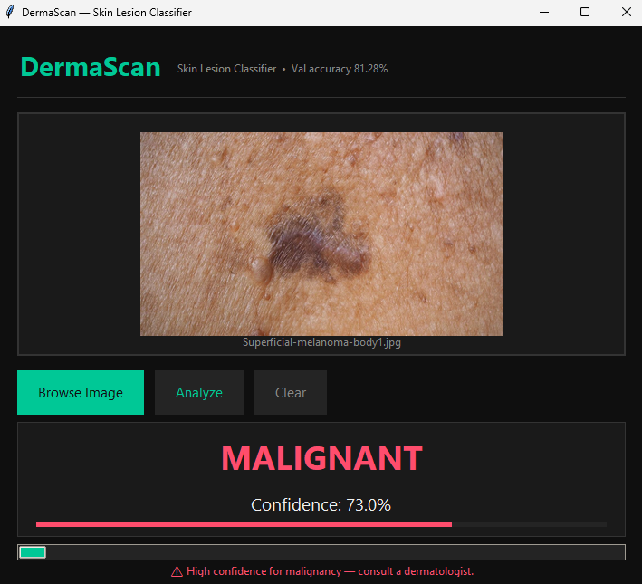
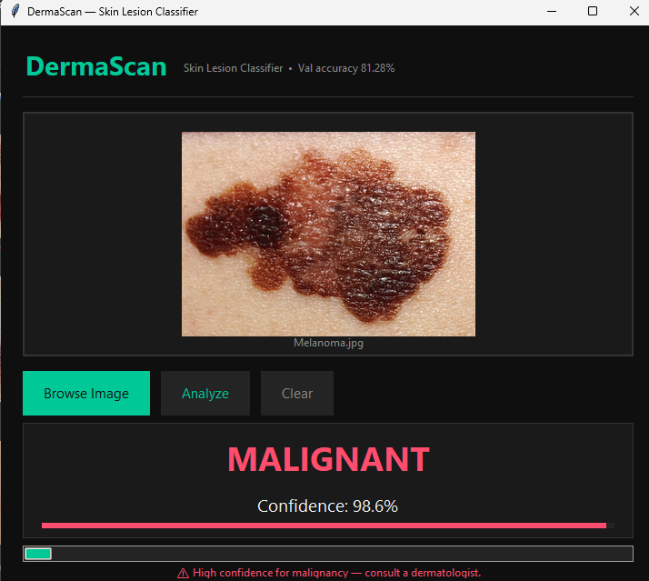
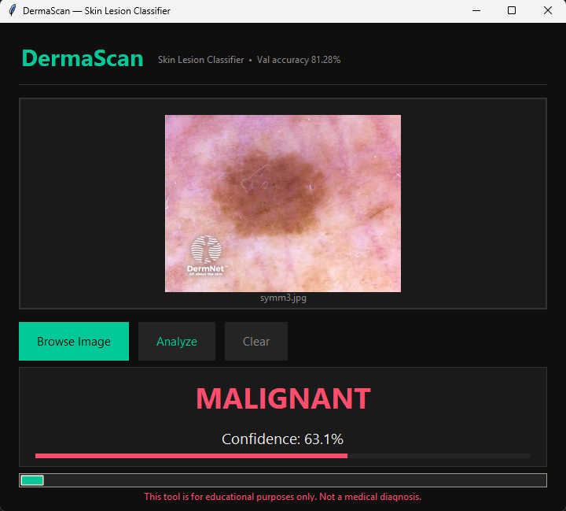
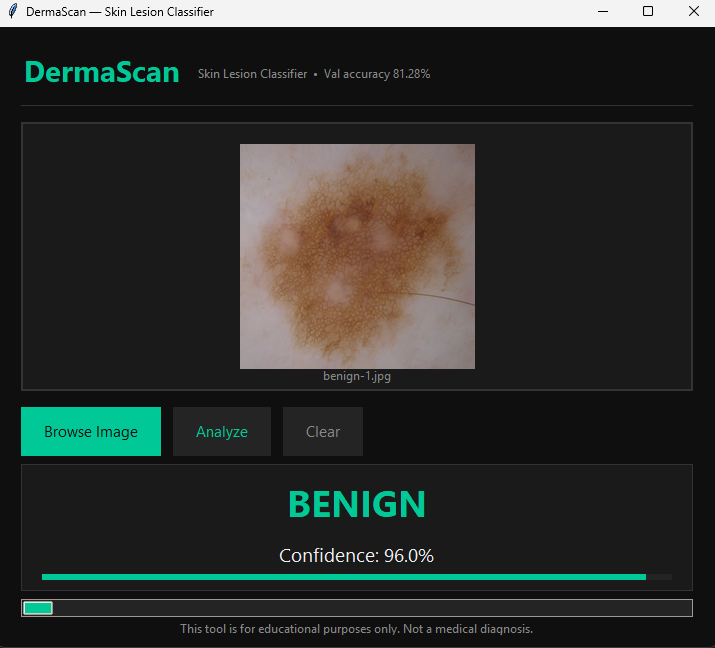
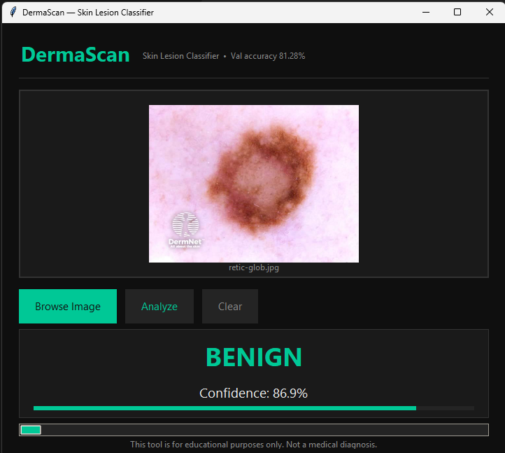

# DermaScan 🔬

A skin lesion classifier that runs completely offline on your PC. Drop in a dermoscopy image, get a malignant/benign prediction with confidence score in under 2 seconds. No internet, no GPU, no cloud — just a double-click.

<p align="center">
  
  
  
  
  
</p>

---

## Download & Run

No Python. No setup. Just extract and double-click.

1. Go to [Releases](../../releases/latest)
2. Download `DermaScan_v1.0_Windows.zip`
3. Extract it
4. Double-click `DermaScan.exe`

First launch takes ~15 seconds while TensorFlow loads. After that it's instant.

---

## What it does

You give it a dermoscopy image of a skin lesion. It tells you whether it looks malignant or benign, and how confident it is. That's it.

I built this because skin cancer is one of the most common cancers out there, and early detection is literally the difference between a quick removal and a serious problem. Dermatologists are expensive and not always accessible. A lightweight AI tool that can flag suspicious lesions for follow-up is genuinely useful — and this project proves it can run on a regular laptop with no internet required.

> ⚠️ Educational project only. Not a medical device. Always see a real dermatologist.

---

## Example Results

**Malignant detections:**

| Image | Result | Confidence |
|-------|--------|------------|
|  | ⚠️ MALIGNANT | 73.0% |
|  | ⚠️ MALIGNANT | 98.6% |
|  | ⚠️ MALIGNANT | 63.1% |

**Benign detections:**

| Image | Result | Confidence |
|-------|--------|------------|
|  | ✅ BENIGN | 96.0% |
|  | ✅ BENIGN | 86.9% |

---

## How it was built

Trained a MobileNetV2 (pretrained on ImageNet) on 3,128 dermoscopy images from the HAM10000 dataset — Harvard's own clinical image database used in the ISIC skin lesion challenge. Two-phase training: first just the classification head, then fine-tuning the top 30 layers. Ran entirely on CPU (AMD Ryzen 5 5600G, no GPU).

| Metric | Value |
|--------|-------|
| Validation Accuracy | **81.28%** |
| AUC-ROC | **0.9005** |
| Training images | 3,128 |
| Architecture | MobileNetV2 + custom head |
| Training time | ~25 min on CPU |

---

## Build from source

```
setup.bat           # installs dependencies
cd model_training
python prepare_dataset.py   # downloads HAM10000
python train.py             # trains the model (~25 min)
cd ..
build.bat           # packages into EXE
```

---

## Stack

```
Python 3.12
TensorFlow 2.18 (CPU)
Keras 3
Pillow
Tkinter
PyInstaller
```

---

## Project structure

```
├── src/app.py                  # GUI app
├── model_training/
│   ├── prepare_dataset.py      # downloads + organizes HAM10000
│   └── train.py                # training pipeline
├── assets/                     # screenshots + icons
├── setup.bat                   # dev environment setup
└── build.bat                   # PyInstaller build
```

---

## References

- Tschandl et al. (2018). *The HAM10000 dataset, a large collection of multi-source dermatoscopic images of common pigmented skin lesions.* Scientific Data.
- Sandler et al. (2018). *MobileNetV2: Inverted Residuals and Linear Bottlenecks.* CVPR.
- [ISIC Archive](https://www.isic-archive.com/)

---

MIT License
